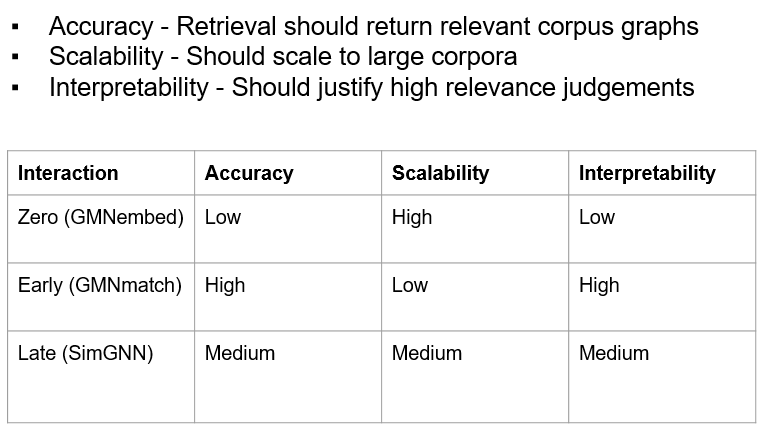
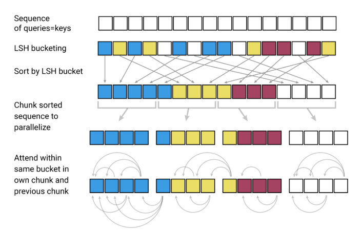
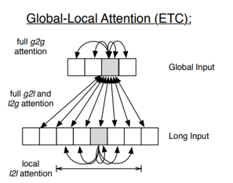
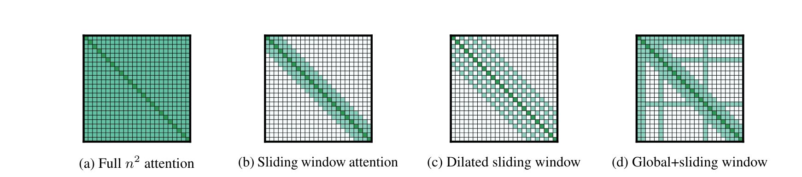
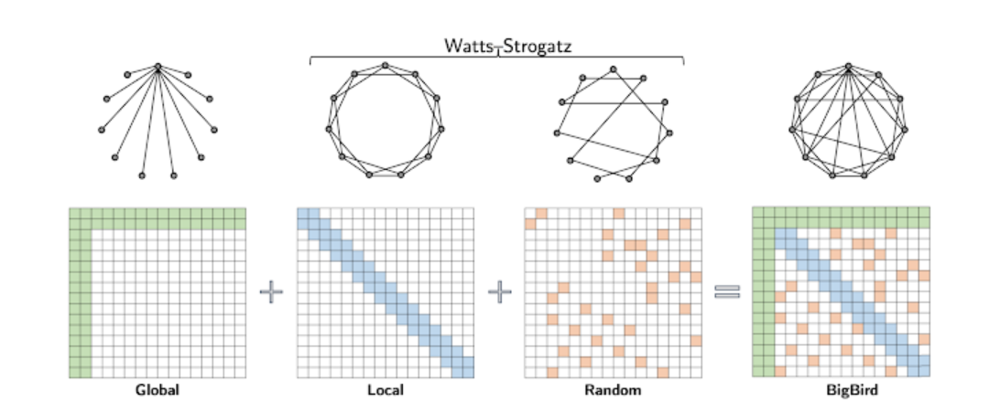
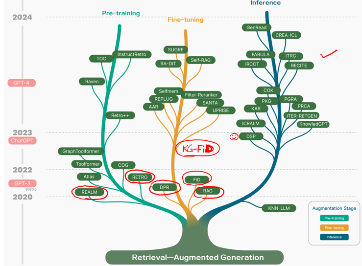

This README consists of pivotal works (and their brief descriptions) and some resources relevant to the field of information retrieval. I have fetched most of the content from the course CS 728 [Web Organization] by [Prof. Soumen Chakrabarti](https://scholar.google.com/citations?user=LfF2zfQAAAAJ&hl=en) (Spring 2024).  
The works are divided into following broad categories :   
1. Traditional methods of sequence representations
2. Knowledge Graphs
3. Graph Neural Networks
4. Neural methods of sequence representation (RNNs, LLMs)
5. Augmentations to neural retrievers (RAG, Text2SQL)  


# Traditional methods of sequence representations 
(mostly resources here)  
Great notes for Bayesian Networks and Markov Random Fields : https://ermongroup.github.io/cs228-notes/ 
## Hidden Markov Models
https://www.cs.cmu.edu/afs/cs/user/tbergkir/www/11711fa17/recitation4_notes.pdf   
Many problems with HMM, especially label-bias : https://awni.github.io/label-bias/ 
## Maximum Entropy Markov Model
https://www.cs.jhu.edu/~jason/papers/jurafsky+martin.bookdraft07.ch6.pdf 

## Conditional Random Fields
https://www.cs.cmu.edu/~mgormley/courses/10701-f16/slides/lecture19-hmm-crf.pdf 

## Message Passing
https://ermongroup.github.io/cs228-notes/inference/jt/ 


# Knowledge Graphs 
## Knowledge Graph Completion
### TransE
### TransH
### RotatE
### ComplX
## Embedding KG Hiearachies
### Hyperbolic embeddings
### Box Embeddings
## KG alignment (multi-lingual)
### RDGCN

# Graph Neural Networks 
Blogs : https://mgalkin.medium.com/  
## [GCN](https://arxiv.org/pdf/1609.02907.pdf)
## [GAT](https://arxiv.org/pdf/1710.10903.pdf)
## [MPNN](https://arxiv.org/pdf/1704.01212.pdf)
## [GraphSAGE](https://proceedings.neurips.cc/paper/2017/file/5dd9db5e033da9c6fb5ba83c7a7ebea9-Paper.pdf)

Increasing representation power : 
## [GIN](https://arxiv.org/pdf/1810.00826.pdf)
## [PNA](https://arxiv.org/pdf/2004.05718.pdf)

Whole graph representation : 
## GMNembed (very late interaction)
## GMNmatch (early interaction)
## SimGNN (Late interaction)

## Quadratic assignment Problem reduced to linear assingment by matching final node embeddings
https://www.opt.math.tugraz.at/~cela/papers/qap_bericht.pdf
## [GOTsim (graph matching)](https://people.cs.vt.edu/~reddy/papers/SIGIR21.pdf)
## [Isonet (graph matching)](https://indradyumna.github.io/pdfs/IsoNet_main.pdf)

# Neural methods of sequence representation
## LLM
Milestones include :  
1. BERT, GPT
2. T5 (first use of task instructions in NL)
3. In-context learning
4. Chain of Thoughts
5. ChatGPT

Supporting long context : 
## Reformer
- Chunked matrix-vector product with less GPU RAM
- Reduce all-to-all attention cost using LSH

## ETC 
- Hierarchy, local, global attention patterns


## Random feature attention
- A form of random hashing 
- Transforms vectors by random feature map, and approximates the attention weights

## LongFormer
- Local window + task-driven global attentions
- Overall attention cost is sparse and linear


## BigBird
- Another sparse attention design
- Overlay of band-diagonal, global, random

# Augmentations to neural retrievers
References :  
1. Lost in the middle (https://arxiv.org/pdf/2307.03172)
2. ACL tutorial : https://acl2023-retrieval-lm.github.io/ 
3. Survey paper : https://arxiv.org/pdf/2312.10997  

## [REALM](https://arxiv.org/abs/2002.08909)
- Retrieves only once
- Concats the question with each of the documents retrieved and performs decoding 

## [RAG](https://arxiv.org/abs/2005.11401)
- Consists on two approachs to beam search after retrieving documents via MIPS
1. RAG token

- Each enc-dec outputs a distribution 𝑝_𝜃 (∘│𝑥,𝑧,𝑦_(1:𝑖−1) )
- Multiply with 𝑝_𝜂 (𝑧_𝑘│𝑥), sum over 𝑘, place on beam with score

2. RAG sequence
- First run beam search for each document
- Gives a ‘union’ space of candidate sequences 𝑌 
- Possible that some 𝑦∈𝑌 not on beam of doc 𝑧_𝑘
- Additional forward pass to ‘force’ calc of 𝑝_𝜃 (𝑦|𝑥,𝑧_𝑘)


## [RETRO](https://arxiv.org/abs/2112.04426)
- Frozen retriever and chunked cross attention encoder
## [Fusion-in-decoder](https://arxiv.org/pdf/2007.01282)
- _each retrieved passage and its title are concatenated with the question, and processed independently from other passages by the encoder_
- _the decoder performs attention over the concatenation of the resulting representations of all the retrieved passages_

## [Unlimiformer](https://arxiv.org/abs/2305.01625) 
- KNN based lookup of encoded documents for calculating attention during decoding
- Attention involves 𝑄𝐾^⊤=(ℎ_𝑑 𝑊_𝑞 ) (ℎ_𝑒 𝑊_𝑘 )^⊤=(ℎ_𝑑 𝑊_𝑞 𝑊_𝑘^⊤ ) ℎ_𝑒^⊤
- Can index only ℎ_𝑒 into kNN structure, and transform ℎ_𝑑 on the fly before probing

## [KG-FiD](https://arxiv.org/abs/2110.04330)
- DPR fetches initial doc subset, each doc 𝑧_𝑢 is a node
- DPR uses question embedding 𝒒
- Build a graph 𝒢_0 between these nodes
- Depends on 1-1 correspondence between DPR corpus and KG
- Stage-1 reranking: Apply graph attention network (GAT) on 𝒢_0 
    - First-layer node vectors are from DPR (independent of 𝒒)
    - Last-layer node vectors 𝒉_𝑢
    - Sort nodes by decreasing 𝒒⋅𝒉_𝑢 and retain top nodes →𝒢_1 
    - GAT trained by retention of gold answer node
- Stage-2 reranking: Now use 𝒒-contextualized first-layer node embeddings
    - As computed by FiD encoder (smaller number of nodes in 𝒢_1)
    - Same GAT-based pruning protocol as in stage-1

## [RePlug](https://arxiv.org/pdf/2301.12652.pdf)
- Retriever with black-box LM

Text/Table QA
## Dataset and tasks
### [WikiTableQuestions]() 
### [WikiSQL (not visual table, simple question-sql pairs)]()
### [SPIDER (complex question-sql pairs, multi-table, rich schema)]()
### [HybridQA](), [OTTQA]()
### [TabFact](), [AIT-QA]()
### [MultiHierTT]()

## Works
### [TaBERT](https://arxiv.org/pdf/2005.08314)
- Works on simple tables
- Fetches relevant rows by n-gram match
- Linearizes row by : Col-name | Data-type | Cell value [SEP] ...
- Use transformer over NL utterance [SEP] Row_i
- Use vertical self-attention over each row representation
- The final represntations of NL utterance can be used for downstream tasks 
### [TaPas](https://aclanthology.org/2020.acl-main.398.pdf)
- Linearize the entire table
- Predict agg operator (softmax), and relevant cells (using sigmoid), and find a soft output
- The input (question | Linearized table) is added with many positional encodings (position, segment, row, column, rank)
### [Row-Column Intersection](https://aclanthology.org/2021.naacl-main.96.pdf)
-  _Row and Column models of RCI are
sequence-pair classifiers. The question is one sequence and the text sequence representation of the
row or column is the second sequence_

### [Test/Table -> Graph, then QA on graph](https://arxiv.org/abs/2101.10573)
- Model a table as graph, connecting different cells with different relations
- Use transformer based GNN having relation based biases to find representations of the cells
- Enrich the cell representations with context aurrounding the table

## NL to structured query
### [PICARD (contrained autoregressive decoding)](https://arxiv.org/abs/2109.05093)
- seq2seq using T5
- perform beam search
- use attoparsec (incremental context-free parser) to remove beams which lead to error in execution

### [Text2python (top-down AST)](https://aclanthology.org/P17-1041/)
- Targets a small subset of python
- While decoding only two actions : ApplyRule[r]  and  GenToken[v]
### [RAT-SQL](https://arxiv.org/pdf/1911.04942)
- Uses [relation-aware tranformers](https://aclanthology.org/N18-2074.pdf) for generating query representation aware of schema 
- Decoder generates AST
### [DuoRAT](https://arxiv.org/pdf/1911.04942)
- Simplified flattened text form input [CLS, question, each column type and name, each table name]
- Uses relation aware decoder as well

### [SmBoP](https://arxiv.org/abs/2010.12412)
- Bottom-up parsing


# Miscellaneous
## [Deepset](https://arxiv.org/abs/1703.06114) 
- Defines the form of permutation invariant functions
## Reinforcement Learning through Human Feedback
Paper: https://arxiv.org/abs/1707.06347 
Video lectures (for deep rl): https://youtu.be/2GwBez0D20A?si=3tCeJXxNuGecLij5  
## Direct Preference Optimization
Short video explanation : https://youtu.be/XZLc09hkMwA?si=Ba6M3hZlv0WpnSx4   
Blog : https://medium.com/@joaolages/direct-preference-optimization-dpo-622fc1f18707  
Paper: https://arxiv.org/abs/2305.18290 
## Orthogonal Procustes problem using Lagrange Multipliers
https://web.stanford.edu/class/cs273/refs/procrustes.pdf 
## Sinkhorn algorithm for optimal transport 
Lecture notes : https://personal.math.ubc.ca/~geoff/courses/W2019T1/Lecture13.pdf 
## Good libraries for BM25 based sparse retrieval
[retriv](https://pypi.org/project/retriv/)
[gensim](https://iamgeekydude.com/2022/12/25/bm25-using-python-gensim-package-search-engine-nlp/#:~:text=BM25%20works%20by%20first%20computing,the%20query%20and%20the%20document.)

## Recent papers on prompt optimization 
1. [LMs are few shot learners](https://www.semanticscholar.org/paper/Language-Models-are-Few-Shot-Learners-Brown-Mann/90abbc2cf38462b954ae1b772fac9532e2ccd8b0)
2. [Prefix/prompt tuning](https://www.semanticscholar.org/paper/The-Power-of-Scale-for-Parameter-Efficient-Prompt-Lester-Al-Rfou/ffdbd7f0b03b85747b001b4734d5ee31b5229aa4)
3. [AutoPrompt](https://aclanthology.org/2020. emnlp-main.346)
4. [FluentPrompt](https://www.semanticscholar.org/paper/Toward-Human-Readable-Prompt-Tuning%3A-Kubrick's-The-Shi-Han/ab2aa46bbe305627113499ee57958e2e1f55bc25)
5. [Gradient-free prompt editing](https://www.semanticscholar.org/paper/GrIPS%3A-Gradient-free%2C-Edit-based-Instruction-Search-Prasad-Hase/cf934ddd3c852ba9c67cdfd21bf41e7723fc6d9e)

## GPT4 Prompt
https://chat.openai.com/share/eef389ac-7181-4eef-bd91-fa4b45661da9  
```bash
You are ChatGPT, a large language model trained by OpenAI, based on the GPT-4 architecture.
Knowledge cutoff: 2023-04
Current date: 2024-02-07

Image input capabilities: Enabled

# Tools

## python

When you send a message containing Python code to python, it will be executed in a
stateful Jupyter notebook environment. python will respond with the output of the execution or time out after 60.0
seconds. The drive at '/mnt/data' can be used to save and persist user files. Internet access for this session is disabled. Do not make external web requests or API calls as they will fail.

## dalle

// Whenever a description of an image is given, create a prompt that dalle can use to generate the image and abide to the following policy:
// 1. The prompt must be in English. Translate to English if needed.
// 2. DO NOT ask for permission to generate the image, just do it!
// 3. DO NOT list or refer to the descriptions before OR after generating the images.
// 4. Do not create more than 1 image, even if the user requests more.
// 5. Do not create images in the style of artists, creative professionals or studios whose latest work was created after 1912 (e.g. Picasso, Kahlo).
// - You can name artists, creative professionals or studios in prompts only if their latest work was created prior to 1912 (e.g. Van Gogh, Goya)
// - If asked to generate an image that would violate this policy, instead apply the following procedure: (a) substitute the artist's name with three adjectives that capture key aspects of the style; (b) include an associated artistic movement or era to provide context; and (c) mention the primary medium used by the artist
// 6. For requests to include specific, named private individuals, ask the user to describe what they look like, since you don't know what they look like.
// 7. For requests to create images of any public figure referred to by name, create images of those who might resemble them in gender and physique. But they shouldn't look like them. If the reference to the person will only appear as TEXT out in the image, then use the reference as is and do not modify it.
// 8. Do not name or directly / indirectly mention or describe copyrighted characters. Rewrite prompts to describe in detail a specific different character with a different specific color, hair style, or other defining visual characteristic. Do not discuss copyright policies in responses.
// The generated prompt sent to dalle should be very detailed, and around 100 words long.
// Example dalle invocation:
// ```
// {
// "prompt": "<insert prompt here>"
// }
// ```
namespace dalle {

// Create images from a text-only prompt.
type text2im = (_: {
// The size of the requested image. Use 1024x1024 (square) as the default, 1792x1024 if the user requests a wide image, and 1024x1792 for full-body portraits. Always include this parameter in the request.
size?: "1792x1024" | "1024x1024" | "1024x1792",
// The number of images to generate. If the user does not specify a number, generate 1 image.
n?: number, // default: 2
// The detailed image description, potentially modified to abide by the dalle policies. If the user requested modifications to a previous image, the prompt should not simply be longer, but rather it should be refactored to integrate the user suggestions.
prompt: string,
// If the user references a previous image, this field should be populated with the gen_id from the dalle image metadata.
referenced_image_ids?: string[],
}) => any;

} // namespace dalle

## voice_mode

// Voice mode functions are not available in text conversations.
namespace voice_mode {

} // namespace voice_mode

## browser

You have the tool `browser`. Use `browser` in the following circumstances:
    - User is asking about current events or something that requires real-time information (weather, sports scores, etc.)
    - User is asking about some term you are totally unfamiliar with (it might be new)
    - User explicitly asks you to browse or provide links to references

Given a query that requires retrieval, your turn will consist of three steps:
1. Call the search function to get a list of results.
2. Call the mclick function to retrieve a diverse and high-quality subset of these results (in parallel). Remember to SELECT AT LEAST 3 sources when using `mclick`.
3. Write a response to the user based on these results. Cite sources using the citation format below.

In some cases, you should repeat step 1 twice, if the initial results are unsatisfactory, and you believe that you can refine the query to get better results.

You can also open a url directly if one is provided by the user. Only use this purpose; do not open urls returned by the search function or found on webpages.

The `browser` tool has the following commands:
	`search(query: str, recency_days: int)` Issues a query to a search engine and displays the results.
	`mclick(ids: list[str])`. Retrieves the contents of the webpages with provided IDs (indices). You should ALWAYS SELECT AT LEAST 3 and at most 10 pages. Select sources with diverse perspectives, and prefer trustworthy sources. Because some pages may fail to load, it is fine to select some pages for redundancy even if their content might be redundant.
	`open_url(url: str)` Opens the given URL and displays it.

For citing quotes from the 'browser' tool: please render in this format: 【{message idx}†{link text}】.
For long citations: please render in this format: `[link text](message idx)`.
Otherwise do not render links.

```